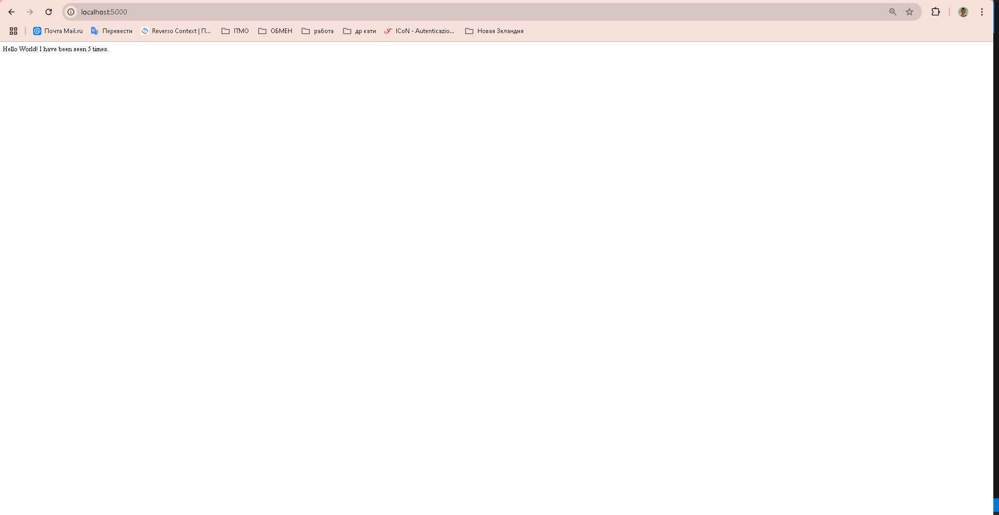
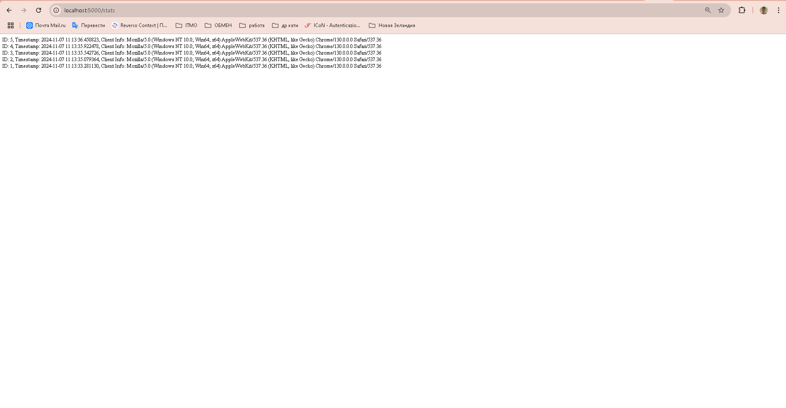
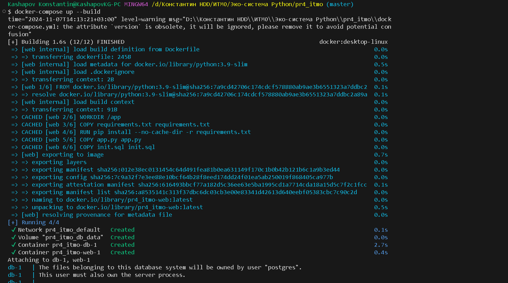
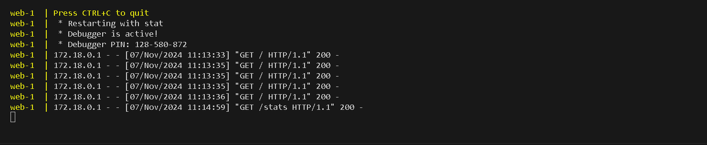

# visits-counter

Автор: Константин Кашапов
Запуск приложения: docker-compose up --build
Оставновка работы: docker-compose down -v

Приложения доступно на хосте по порту 5000
Данные о запросах и пользователях достпуны по пути /stats

## Отчет

### Создаю файлы requirements.txt, init.sql, Dockerfile, docker-compose.yml и app.py

#### requirements.txt и Dockerfile

В requirements.txt прописываю зависимости
В докерфайле использую образ python:3.9-slim, рабочая директория /app, дальше копирую и устанавливаю файлы зависимостей.
Копирую код приложения и запускаю его.

#### init.sql

В файле инициализации бд создаю таблицу hits если такой таблицы ещё нет
Поле id имеет специальный тип данных, автоматические создаются последовательный целые числа при вставке новой строки, ключ уникален и не содержит значения null
Столбец сounter хранит целые числа, не может содержать значения NULL, по умолчанию равно 0
Столбец timestamp хранит дату и время, не может быть пустым, по умолчанию автоматичеки заполняет таблиццу текущими значениями времени
client_info может содержать строку произольной длины, значение не равно null

#### docker-compose.yml

Указываю версию docker-compose
Указывыаю сервисы, которые будут запущены
Сервис db использует образ postgres:13
Задаю переменные окружения, имя БД, имя пользователя, пароль
Определяю тома - том для хранения данных PostgreSQL и монтирование локального файлаinit.sql в директорию контейнера, где СУБД будет автоматически выполнять команды
Сервис web зависит от сервиса db, порт 5000 хоста перенаправлен на порт 5000 внутри контейнера, то есть порт будет доступен извне, образ сервиса будет создан в текущей директории
В Volumes определяется именованный том db_data, который будет использоваться для хранения данных PostgreSQL, то есть данные сохранятся даже после удаления контейнера

#### app.py

Работа приложения кратко изложена в комментариях

#### Скрины

